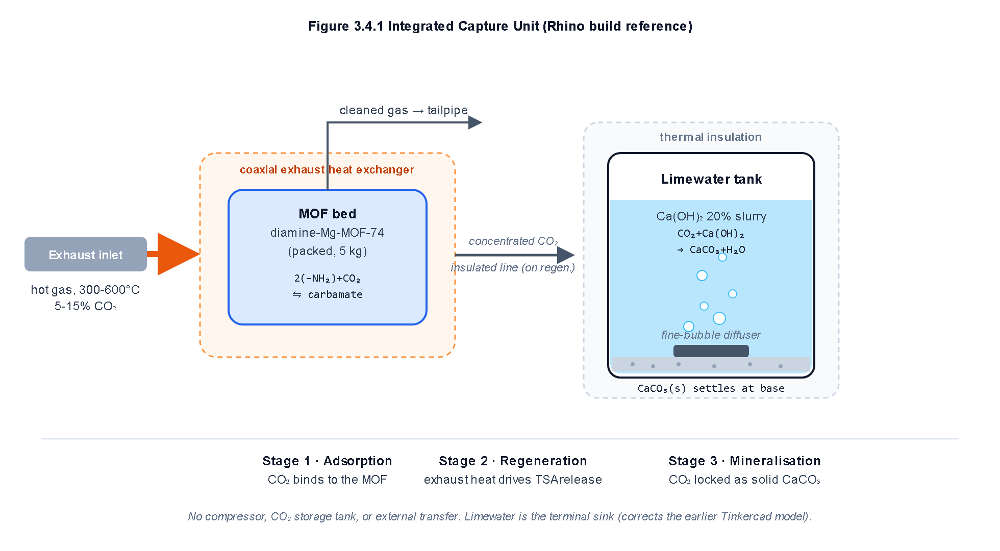

# Onboard Vehicular CO2 Capture and Aqueous Mineralization Simulator

[](https://vercel.com/new/clone?repository-url=https://github.com/panavkbysani2011-jpg/vehicular-mof-co2-capture)
[](https://opensource.org/licenses/MIT)
[](https://www.python.org/)
[](https://github.com/panavkbysani2011-jpg/vehicular-mof-co2-capture)

An open-access computational modeling framework and interactive web simulation for point-of-origin onboard vehicular carbon capture, coupling diamine-appended metal-organic frameworks (Mg-MOF-74) with passive exhaust waste heat regeneration and ambient limewater mineralization.

---

## Authors and Affiliation

- **Advik Harihar** (Lead Author, Student)
- **Panav K Bysani** (Co-Author, Student)
- **Yash Verma** (Chemistry Mentor, M.Tech IIT Kharagpur, Chemistry Faculty)

**Project Presentation**: IRIS National Science Fair  

---

## Project Overview

Internal combustion engine vehicles release carbon dioxide directly at street level, making mobile transport a primary driver of global greenhouse gas emissions. Conventional mobile carbon capture systems rely on energy-intensive mechanical compressors and heavy high-pressure gas cylinders (200 to 350 bar), introducing severe weight, volume, and safety penalties.

This project designs and simulates an unpressurized, passive onboard capture-and-mineralization architecture that permanently sequesters tailpipe CO2 directly into solid calcium carbonate (CaCO3, calcite).

### Key Performance Metrics (77-Minute Driving Cycle):
- **Adsorption Capacity**: Under 13.5% exhaust CO2, a 5.0 kg bed of diamine-appended Mg-MOF-74 captures 0.805 kg of CO2 (95.4% equilibrium saturation).
- **Passive Thermal Regeneration**: The 1063 kJ regeneration duty is passively supplied by engine exhaust waste heat in under 55 seconds with zero alternator or electrical battery draw.
- **Permanent Solid Mineralization**: Desorbed gas reacts irreversibly with a 30 L limewater slurry (20 wt% Ca(OH)2), precipitating 0.735 kg (at 85 deg C) to 1.678 kg (at 110 deg C) of solid calcite.
- **Chassis Packaging Feasibility**: Sorbent bed envelope occupies 5.56 L, induces an exhaust back-pressure of only 0.68 kPa (automotive safety limit: 5.0 kPa), and imposes a modest 3.07% fuel economy penalty on a 1500 kg passenger vehicle.

---

## System Architecture

The capture system couples three coordinated stages:

1. **Chemisorptive Adsorption Bed**: Exhaust gas is ducted through a packed cylindrical canister of diamine-appended Mg-MOF-74 (m-2-m-Mg-dobpdc). Reversible carbamate chains cooperatively capture tailpipe CO2.
2. **Coaxial Waste Heat Exchanger**: When the bed reaches target saturation, a bypass diverts high-temperature exhaust gas (300 to 600 deg C) around the bed jacket, thermally driving off CO2 at 85 to 110 deg C.
3. **Aqueous Mineralization Bubbler**: The liberated gas sparges through a micro-perforated diffuser into an unpressurized ambient tank containing 20 wt% Ca(OH)2 slurry, yielding solid CaCO3 precipitate.



---

## Mathematical Model and Algorithm

The numerical simulation executes time-stepped calculations governed by empirical literature kinetics and thermodynamics:

```mermaid
graph TD
    A[Engine Ignition: Exhaust Flow at 13.5% CO2] --> B[Phase 1: Packed MOF Chemisorption]
    B --> C[Compute Dynamic Uptake: dq/dt = k * (q_eq - q)]
    C --> D{Cycle Time t = 77 min?}
    D -- No --> C
    D -- Yes --> E[Phase 2: Exhaust Waste Heat Diversion]
    E --> F[Calculate Sigmoid Release: sigma(T) = 1 / (1 + exp(-0.08 * (T - 90)))]
    F --> G[Liberate Gas & Calculate Thermal Duty: Q_total = Q_sensible + Q_desorb]
    G --> H[Phase 3: Sparging into 30 L Limewater Tank]
    H --> I[Stoichiometric Calcite Yield: m_CaCO3 = m_released * 2.274]
    I --> J[Log Energy, Back-Pressure, and Calcite Output]
```

Detailed mathematical derivations, nomenclature, and equations are documented in [`docs/ALGORITHM_AND_MODEL.md`](docs/ALGORITHM_AND_MODEL.md).

---

## Interactive Web Simulator

A publication-grade, responsive web application is built into the repository root (`index.html`) using Vanilla HTML5, CSS3, and Chart.js.

### Simulator Features:
- **Five Real-Time Controls**:
  - MOF Sorbent Mass: 0.1 kg to 10.0 kg
  - Inlet Exhaust CO2: 0.1% to 20.0%
  - Driving Cycle Duration: 10 min to 180 min
  - Regeneration Temperature: 40 deg C to 150 deg C (with 85 deg C and 110 deg C quick presets)
  - Limewater Slurry Volume: 5 L to 60 L
- **Six Real-Time Charts**:
  - Adsorbed Mass vs. Time (q(t) breakthrough curve)
  - Calcite Produced vs. Time (CaCO3 precipitation curve)
  - Specific Energy Consumption vs. Temperature (kJ/kg CO2)
  - Mass of CO2 Liberated vs. Temperature (desorption curve)
  - Dual-Axis Breakthrough Kinetics
  - Dual-Axis Thermal Operating Window
- **Packaging and Back-Pressure Gauge**: Computes cylinder dimensions (D x L), back-pressure (<5.0 kPa safe limit check), and vehicle fuel penalty.
- **Sensitivity Matrix Table**: Real-time multi-temperature thermal sweep (70 to 130 deg C).
- **KaTeX Equations Modal**: Built-in LaTeX mathematical reference.

---

## Deploying to Vercel (Instant 1-Click)

The simulator is static with zero dependencies, making it deployable on Vercel:

1. Click the **Deploy with Vercel** button above or go to [vercel.com](https://vercel.com).
2. Select **"Add New..."** > **"Project"**.
3. Import this repository (`panavkbysani2011-jpg/vehicular-mof-co2-capture`).
4. Keep the default settings (Framework Preset: **Other**, Root Directory: `./`).
5. Click **Deploy**. Vercel will build and assign a permanent live URL in under 20 seconds.

---

## Running Locally

### 1. Launch the Interactive Web Simulator
No installation or build tools required. Open `index.html` directly in any web browser:
```bash
# Double-click index.html or open from terminal
start index.html       # Windows
open index.html        # macOS
xdg-open index.html    # Linux
```

### 2. Run the Standalone Python Numerical Model
```bash
# Requires Python 3.8+ and matplotlib
python co2_capture_simulation.py
```
This runs the full 77-minute driving cycle, prints energy and mass balances to the terminal, and exports `multi_cycle_results.png`.

---

## Repository Structure

```text
vehicular-mof-co2-capture/
├── .gitignore                          # Standard gitignore (temp files, cache)
├── LICENSE                             # MIT License
├── README.md                           # Master project documentation
├── vercel.json                         # Vercel static hosting routing configuration
├── index.html                          # Complete interactive simulator web app
├── mof simulation.html                 # Supplementary simulator copy
├── co2_capture_simulation.py           # Standalone Python simulation script
├── simulation_results.csv              # Driving cycle time-series dataset
├── sensitivity_matrix.csv              # Multi-temperature regeneration sweep
├── docs/
│   └── ALGORITHM_AND_MODEL.md          # In-depth algorithmic and thermodynamic guide
└── figures/
    ├── Figure_3.4.1_system_schematic.png       # Exhaust-coupled system architecture
    ├── Figure_3.4.2_algorithm_flowchart.png    # Time-stepped numerical solver flowchart
    ├── Figure_4.1_adsorption_curve.png         # Adsorption breakthrough kinetics (300 DPI)
    ├── Figure_4.2_multicycle_results.png       # Multi-cycle operational performance
    └── Figure_4.3_thermal_desorption_energy.png # Sigmoidal desorption and energy intensity (300 DPI)
```

---

## Citation

If you use this simulation model or conceptual architecture in your work, please cite:

```bibtex
@misc{harihar2026onboard,
  title={Onboard Capture and Mineralisation of Vehicle Exhaust CO2 Using Diamine-Appended Mg-MOF-74 and Limewater: A Conceptual and Simulation Study},
  author={Harihar, Advik and Bysani, Panav K},
  year={2026}
}
```

---

## License

This project is licensed under the MIT License. See [`LICENSE`](LICENSE) for details.
