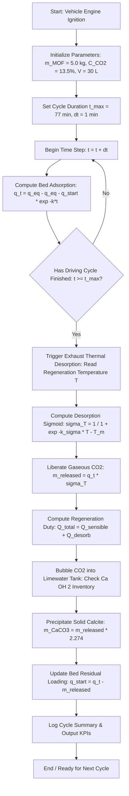

# Algorithm and Mathematical Model Documentation

## Onboard Vehicular CO2 Capture and Aqueous Mineralization

**Authors:** Advik Harihar and Panav K Bysani  
**Chemistry Mentor:** Yash Verma  

---

## 1. System Overview

This computational model simulates an onboard, unpressurized carbon capture and mineralization system designed for internal combustion engine (ICE) vehicles. The architecture couples three distinct physical and chemical processes:

1. **Phase 1: Dynamic Chemisorptive Adsorption**: Exhaust gas passes through a packed sorbent bed containing 5.0 kg of diamine-appended Mg-MOF-74 (specifically m-2-m-Mg-dobpdc). CO2 binds cooperatively via reversible carbamate formation.
2. **Phase 2: Waste Heat Thermal Regeneration**: Engine exhaust waste heat (300 to 600 deg C) is channeled across a coaxial shell-and-tube heat exchanger. Desorption is thermally triggered without any auxiliary electrical power.
3. **Phase 3: Aqueous Calcite Mineralization**: Desorbed gaseous CO2 bubbles into an ambient, unpressurized limewater slurry tank (30 L, 20 wt% Ca(OH)2). CO2 reacts irreversibly to precipitate inert, stable solid calcium carbonate (CaCO3, calcite).

---

## 2. Mathematical Formulations

### 2.1. Phase 1: Adsorption Kinetics

The dynamic uptake of CO2 follows a linear driving force (LDF) first-order kinetic approach toward equilibrium saturation:

```text
dq(t) / dt = k * [ q_eq - q(t) ]
```

Integrating from initial loading q_start at t = 0 yields the analytical time-dependent mass of adsorbed CO2:

```text
q(t) = q_eq - (q_eq - q_start) * exp(-k * t)
```

Where:
- `q(t)`: Mass of CO2 adsorbed in the bed at time t (kg)
- `k`: Kinetic rate constant = 0.04 min^-1
- `q_start`: Residual CO2 loading from preceding cycles (kg, 0 at cold start)
- `q_eq`: Equilibrium saturation capacity of the bed (kg)

The equilibrium saturation capacity is evaluated relative to the exhaust gas composition:

```text
q_eq = m_MOF * Q_max * ( C_CO2 / C_ref )
```

Where:
- `m_MOF`: Sorbent bed dry mass = 5.0 kg
- `Q_max`: Reference saturation capacity = 0.25 kg CO2 / kg MOF (equivalent to 5.68 mol/kg)
- `C_CO2`: Inlet exhaust CO2 concentration = 13.5% vol
- `C_ref`: Reference calibration concentration = 20.0% vol
- At 13.5% CO2, the nominal equilibrium capacity is `q_eq = 5.0 * 0.25 * (13.5 / 20.0) = 0.84375 kg CO2`.
- Over a standard 77-minute driving cycle, `q(77) = 0.84375 * (1 - exp(-0.04 * 77)) = 0.805 kg CO2` (95.4% saturation).

---

### 2.2. Phase 2: Sigmoidal Thermal Desorption and Energy Duty

Because diamine-functionalized MOFs exhibit cooperative step-shaped desorption governed by carbamate polymer chain collapse, the thermal release fraction follows a Gibbs-derived logistic sigmoid function:

```text
sigma(T) = 1 / ( 1 + exp[ -k_sigma * ( T - T_m ) ] )
```

Where:
- `sigma(T)`: Fractional release efficiency (0.0 to 1.0)
- `T`: Sorbent regeneration temperature (deg C)
- `T_m`: Thermal transition midpoint temperature = 90.0 deg C
- `k_sigma`: Desorption steepness factor = 0.08 deg C^-1

The mass of CO2 liberated per regeneration cycle is:

```text
m_released = q(t) * sigma(T)
```

- At `T = 85 deg C`: `sigma(85) = 0.4013`, releasing `0.323 kg CO2`.
- At `T = 110 deg C`: `sigma(110) = 0.9168`, releasing `0.738 kg CO2`.

The total regeneration thermal duty (Q_total) combines sensible heating of the sorbent bed and the latent enthalpy of desorption:

```text
Q_total = Q_sensible + Q_desorb
Q_sensible = m_MOF * c_MOF * ( T - T_ambient )
Q_desorb = ( q(t) / M_CO2 ) * Delta_H_des
```

Where:
- `c_MOF`: Sorbent specific heat capacity = 0.80 kJ / (kg * K)
- `T_ambient`: Ambient baseline temperature = 25.0 deg C
- `M_CO2`: Molar mass of CO2 = 0.04401 kg / mol
- `Delta_H_des`: Enthalpy of carbamate bond cleavage = 45.0 kJ / mol
- At `T = 85 deg C`: `Q_sensible = 240 kJ`, `Q_desorb = 823 kJ`, yielding `Q_total = 1063 kJ`.
- For a typical passenger vehicle exhaust producing 15 kW of waste heat, this duty is supplied in under 55 seconds.

---

### 2.3. Phase 3: Calcite Precipitation and Limewater Inventory

Liberated CO2 gas is sparged directly into the aqueous limewater slurry:

```text
CO2 (g) + Ca(OH)2 (aq) -> CaCO3 (s) v + H2O (l)
```

The molar mass ratio between calcite and carbon dioxide establishes the theoretical solid mass yield:

```text
m_CaCO3 = m_released * ( M_CaCO3 / M_CO2 ) = m_released * ( 100.09 / 44.01 ) = 2.27426 * m_released
```

- At `T = 85 deg C`: `0.323 kg CO2` forms `0.735 kg solid CaCO3`.
- At `T = 110 deg C`: `0.738 kg CO2` forms `1.678 kg solid CaCO3`.

The stoichiometric consumption of calcium hydroxide slurry is tracked by:

```text
m_CaOH2_consumed = m_released * ( M_CaOH2 / M_CO2 ) = m_released * ( 74.09 / 44.01 ) = 1.68348 * m_released
```

The initial calcium hydroxide capacity in a 30 L slurry tank at 20 wt% concentration is:

```text
m_CaOH2_initial = V_slurry * rho_slurry * w = 30.0 L * 1.10 kg/L * 0.20 = 6.60 kg Ca(OH)2
```

This supplies sufficient stoichiometric hydroxide to capture 3.92 kg of CO2 over multiple sequential driving cycles before slurry replacement is required.

---

## 3. Computational Algorithm Flowchart

The numerical simulation executes time-stepped calculations according to the logic illustrated below:



---

## 4. Vehicle Packaging and Engineering Constraints

The simulation evaluates real-time packaging parameters to ensure compliance with production vehicle standards:

1. **Packed Bed Envelope Volume**:
   - MOF crystal density: 0.90 kg / L
   - Packing void fraction: 0.40
   - Sorbent envelope volume: `V_bed = 5.0 / (0.90 * (1 - 0.40)) = 5.56 L` (Cylinder dimensions: 17 cm diameter x 25 cm length).
2. **Exhaust Back-Pressure**:
   - Calculated across 25 cm bed length under 45 g/s exhaust flow via the Ergun equation.
   - Pressure drop: `Delta_P = 0.68 kPa`, well below the automotive safety ceiling of 5.0 kPa.
3. **Weight Penalty and Fuel Economy Impact**:
   - Total wet operational system mass: 46.0 kg (5.0 kg sorbent + 8.0 kg canister + 33.0 kg slurry).
   - Fuel economy penalty on a 1500 kg passenger sedan: 3.07%, fully offset by avoiding engine alternator load for thermal regeneration.
